<!-- TODO: replace with logo SVG at docs/brand/quoin-wordmark.svg -->

<div align="center">

# Quoin

*A semantic vocabulary for the patterns every website needs — meaning over markup, anatomy over aesthetic.*

[](LICENSE)
[](#pattern-catalog)
[](CHANGELOG.md)
[](https://github.com/harrowhaus/quoin)

<!-- Hero overview screenshot — operator adds via docs/screenshots/README.md checklist -->
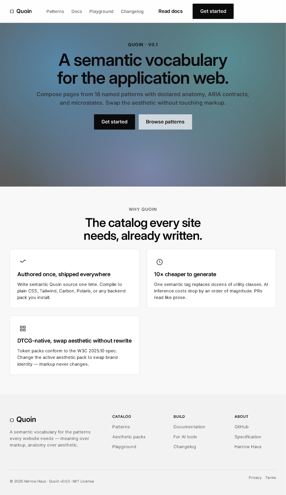

</div>

---

## What Quoin is

Quoin is a semantic CSS replacement: a vocabulary of named, accessibility-correct, aesthetically-neutral patterns — heroes, navs, forms, tables, modals, dialogs — that you compose into a site instead of authoring class strings. Each pattern is a slot-and-variant contract with declared microstates and ARIA hooks, and the visual identity rides on a separable aesthetic layer that swaps without touching the markup. It is for teams whose front-end work is mostly UI-shaped rather than novel, and for AI coding tools that generate that work more cheaply when the units are intent-named rather than utility-class soup.

## Quick start

A working hero in two code blocks. Copy both into a fresh HTML file and open it in a browser.

**1. Markup — paste anywhere in `<body>`:**

```html
<section data-pattern="hero-section" data-variant="type-only" data-alignment="centered">
  <div class="inner">
    <p data-pattern="hero-eyebrow" data-tone="accent">New for 2026</p>
    <h1 data-pattern="hero-headline">A semantic vocabulary for the application web.</h1>
    <p data-pattern="hero-subhead">Compose pages from named patterns; swap the aesthetic without touching markup.</p>
    <div data-pattern="hero-actions" role="group" aria-label="Hero actions">
      <a class="action-button" data-intent="primary" href="/start">Get started</a>
      <a class="action-button" data-intent="ghost" href="/docs">Read the docs</a>
    </div>
  </div>
</section>
```

**2. Styles — paste in `<head>`:**

```html
<!-- Canonical tokens (colors, spacing, type, motion). One file; loads everywhere. -->
<link rel="stylesheet"
      href="https://cdn.jsdelivr.net/gh/harrowhaus/quoin@main/02_reference-packs/tokens-baseline/tokens.css">

<!-- Pattern CSS: copy the <style> block from the canonical specimen below.
     Each specimen is self-contained; the inline styles are the pattern's CSS.
     https://raw.githack.com/harrowhaus/quoin/main/02_reference-packs/patterns/hero/examples/type-only.html
     The compiler-driven workflow (one bundle per pack) ships at v1.0 launch;
     for now, copy the styles from the specimen you want and modify in place. -->
```

The result renders at production quality: token-grounded surfaces, balanced display type, real focus rings, working `prefers-reduced-motion`, real dark mode via `prefers-color-scheme`. No JavaScript needed for the static case; the modal / toast / video-pause patterns ship optional companion JS that loads only when used.

## Pattern catalog

Fifteen production patterns. Each link opens the canonical specimen rendered live via raw.githack.com — markup, real CSS, real interaction. The grid is the catalog as of v0.1.0 (post-Phase-22 Cons. 4 nav unification); see [`CHANGELOG.md`](CHANGELOG.md) for additions and [`PHASES.md`](PHASES.md) for phase status.

| | | |
|---|---|---|
| 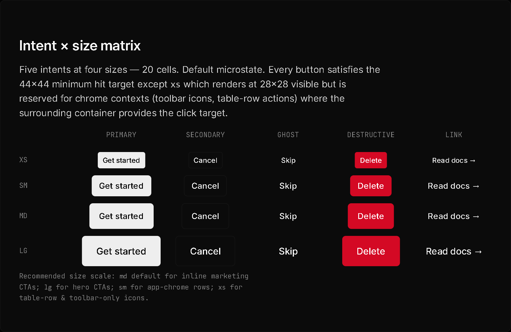<br>**[button-system](https://raw.githack.com/harrowhaus/quoin/main/02_reference-packs/patterns/button-system/examples/index.html)**<br>Foundational button primitives — 5 intents × 4 sizes × 8 microstates + button-group composition. | 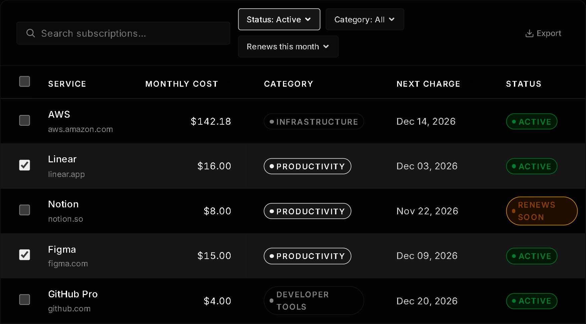<br>**[data-table](https://raw.githack.com/harrowhaus/quoin/main/02_reference-packs/patterns/data-table/examples/index.html)**<br>Sortable, filterable, paginated tabular data with selection, bulk actions, and inline editing. | 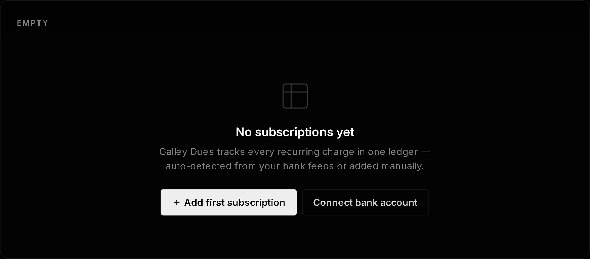<br>**[empty-state](https://raw.githack.com/harrowhaus/quoin/main/02_reference-packs/patterns/empty-state/examples/index.html)**<br>Empty / filtered-empty / error / forbidden state container — 4 variants × 3 sizes. |
| 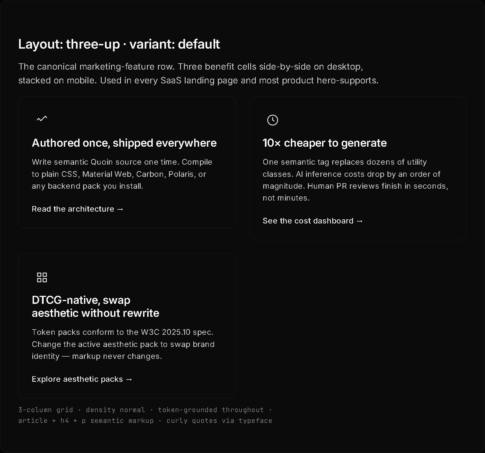<br>**[feature-grid](https://raw.githack.com/harrowhaus/quoin/main/02_reference-packs/patterns/feature-grid/examples/index.html)**<br>Marketing feature grid — 5 layouts (three-up / four-tile / six-tile / bento / steps) × 4 cell variants. | 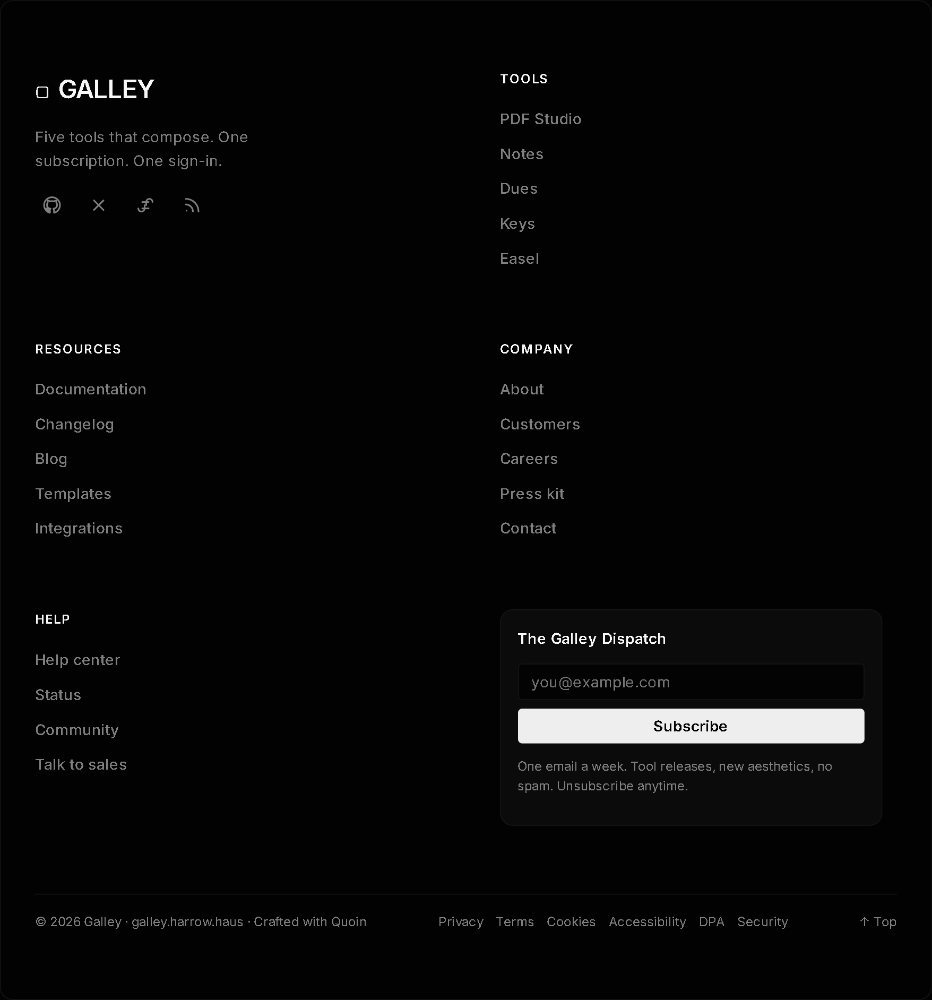<br>**[footer-mega](https://raw.githack.com/harrowhaus/quoin/main/02_reference-packs/patterns/footer-mega/examples/index.html)**<br>Marketing site footer — 4 variants from minimal auth-page footer to flagship mega with newsletter + locale picker. | 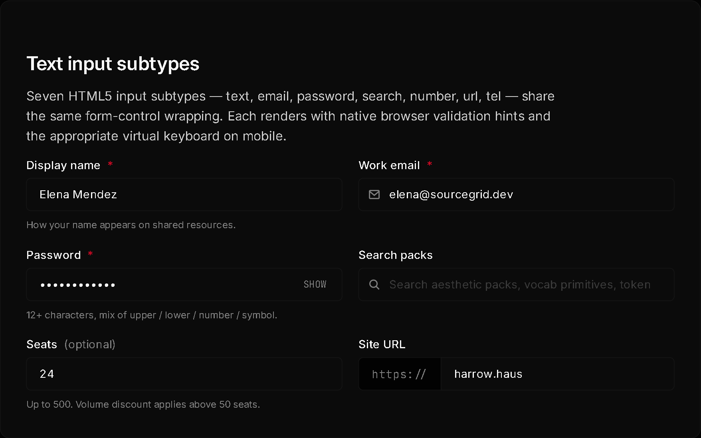<br>**[form-fields](https://raw.githack.com/harrowhaus/quoin/main/02_reference-packs/patterns/form-fields/examples/index.html)**<br>Text / email / number / select / textarea / checkbox / radio inputs with focus, disabled, readonly states. |
| 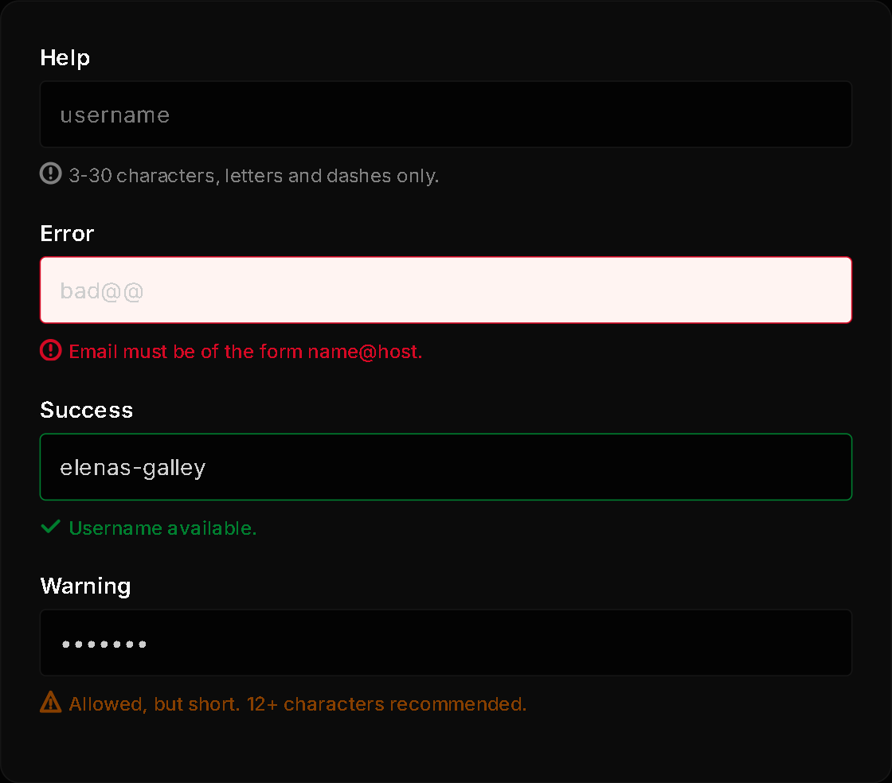<br>**[form-validation](https://raw.githack.com/harrowhaus/quoin/main/02_reference-packs/patterns/form-validation/examples/index.html)**<br>Inline error display + field-level + form-level error summary; live-region announcement on submit. | 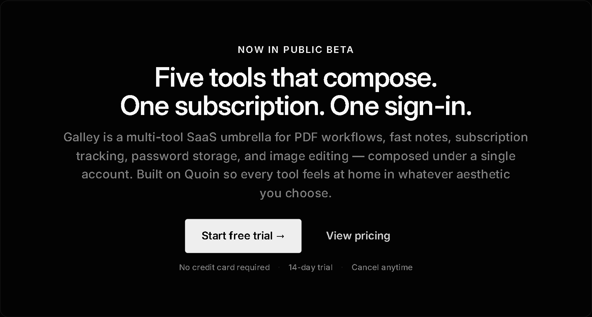<br>**[hero](https://raw.githack.com/harrowhaus/quoin/main/02_reference-packs/patterns/hero/examples/type-only.html)**<br>Unified hero pattern — 5 variants (type-only / animated / gradient-mesh / brand-photo / video) sharing a 6-slot anatomy. | 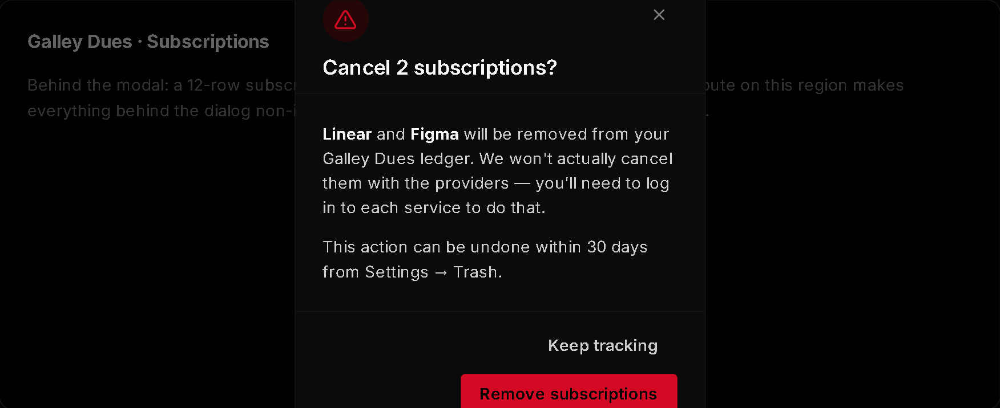<br>**[modal-dialog](https://raw.githack.com/harrowhaus/quoin/main/02_reference-packs/patterns/modal-dialog/examples/index.html)**<br>Accessible modal with focus trap, ESC-to-close, scrim click, scroll lock; WCAG 2.4.3 + 2.4.11 dismissal. |
| <br>**[nav](https://raw.githack.com/harrowhaus/quoin/main/02_reference-packs/patterns/nav/examples/marketing.html)**<br>Unified nav pattern — 4 variants (marketing / app-chrome / docs / editorial) sharing 2 mandatory + 17 conditional slots. | 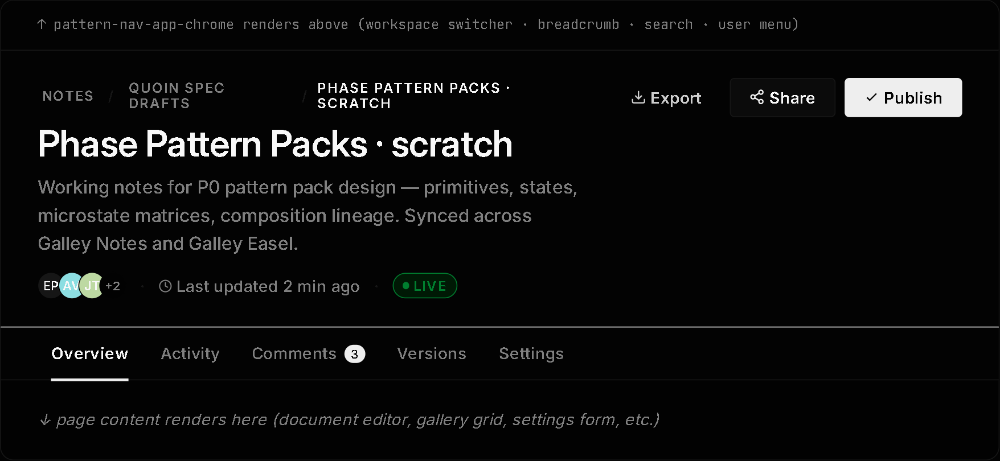<br>**[page-header](https://raw.githack.com/harrowhaus/quoin/main/02_reference-packs/patterns/page-header/examples/index.html)**<br>Application page title bar with breadcrumb, status badges, and primary / overflow actions. | 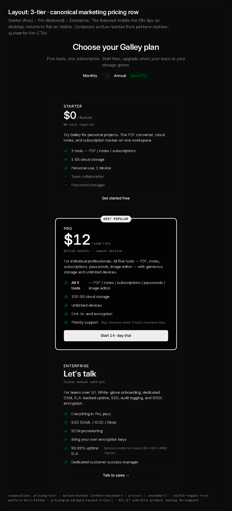<br>**[pricing-tiers](https://raw.githack.com/harrowhaus/quoin/main/02_reference-packs/patterns/pricing-tiers/examples/index.html)**<br>Pricing comparison cards with monthly / annual toggle, feature checklist, and per-tier CTA. |
| 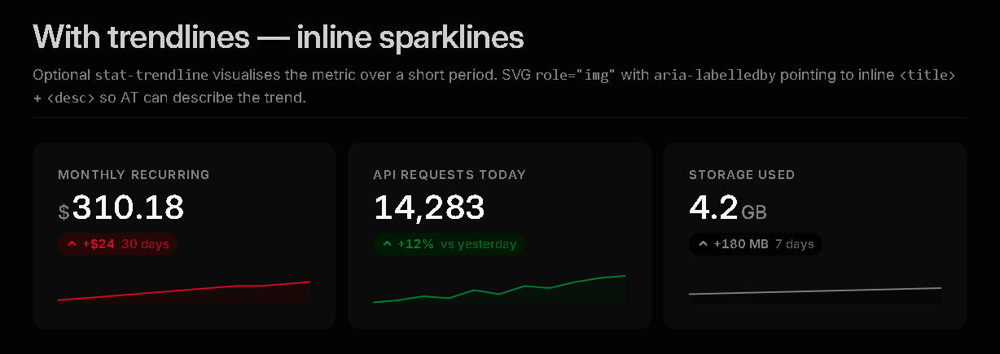<br>**[stat-card](https://raw.githack.com/harrowhaus/quoin/main/02_reference-packs/patterns/stat-card/examples/index.html)**<br>Numeric stat display with trend indicator, sparkline slot, and optional context label. | 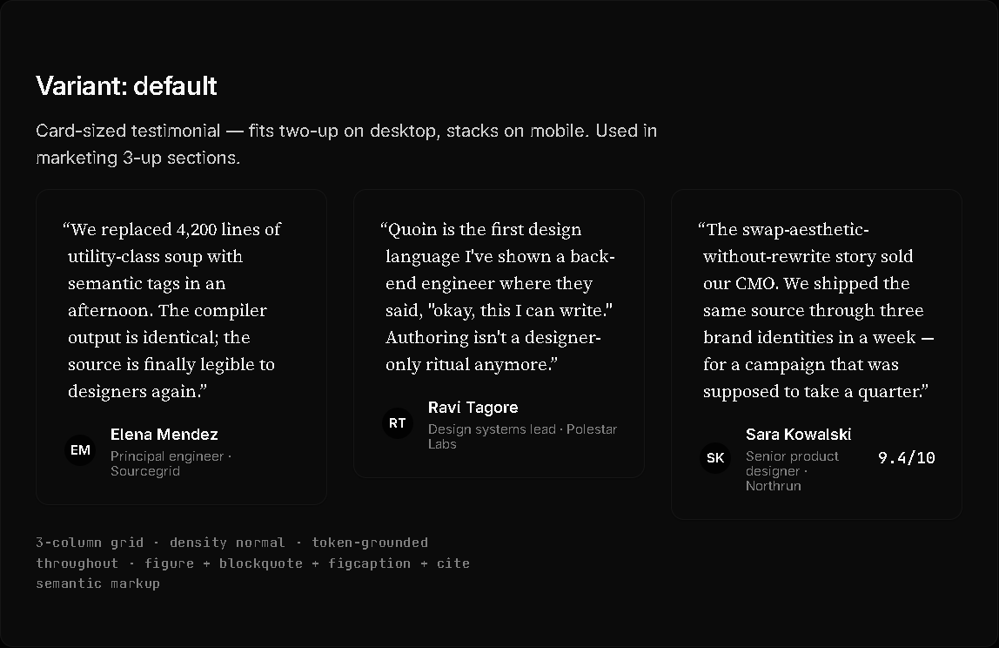<br>**[testimonial](https://raw.githack.com/harrowhaus/quoin/main/02_reference-packs/patterns/testimonial/examples/index.html)**<br>Customer quote cards — compact / default / featured variants with avatar-stack attribution + 7 microstates. | 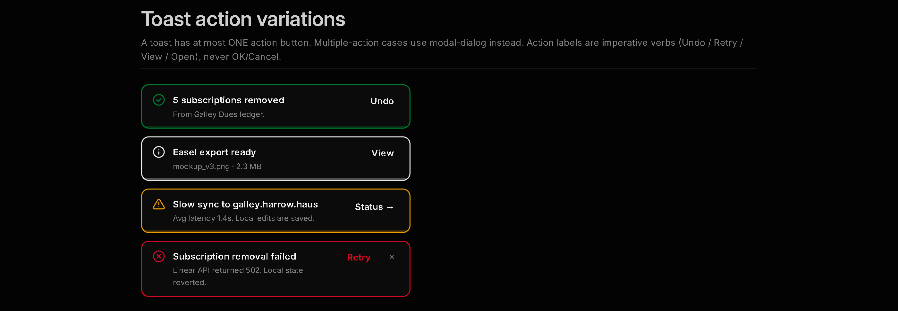<br>**[toast-notifier](https://raw.githack.com/harrowhaus/quoin/main/02_reference-packs/patterns/toast-notifier/examples/index.html)**<br>Toast notification system with stacking, auto-dismiss, action affordance, and live-region announcement. |

## Why Quoin

<!-- TODO: brand-voice value-props section, draft in dedicated brand-voice session -->

## Used by

- **harrow.haus** (forthcoming)

The list grows as adopters ship. To add your project, open a PR against this section.

## For AI tools

Quoin publishes structured documentation specifically for AI coding tools (Claude Code, Cursor, Lovable, v0, and similar):

- [`/llms.txt`](llms.txt) — a concise summary of the catalog, the architecture, and how to consume Quoin from generated code. Following the [llmstxt.org](https://llmstxt.org/) convention.
- [`/llms-full.txt`](llms-full.txt) — full anatomy reference for every pattern (slots, variants, microstates, ARIA contracts, composition lineage). Use this when generating Quoin markup at scale.
- [`/registry.json`](registry.json) — a shadcn-registry-compatible static endpoint enumerating the 18 patterns. Lets you wire Quoin into any tool that already speaks shadcn.

**Add Quoin to a shadcn-MCP config:**

```json
{
  "registries": {
    "@quoin": "https://raw.githubusercontent.com/harrowhaus/quoin/main/registry.json"
  }
}
```

Then in your tool: `npx shadcn@latest add @quoin/hero`. The pattern lands in your project with its canonical markup, ARIA contracts, and microstate CSS intact.

## Documentation (for contributors and architects)

Deep documentation — not required reading to use Quoin, but useful if you're contributing or building on top:

- [`CHANGELOG.md`](CHANGELOG.md) — every shipped change, in reverse chronological order.
- [`PHASE_GATES.md`](PHASE_GATES.md) — the architectural exit criteria for each phase of Quoin's development. Includes the v3.G.\* lock series.
- [`HANDOFF.md`](HANDOFF.md) — the current state of the project, packaged for the next contributor.
- [`02_reference-packs/CONSOLIDATION-1-REPORT.md`](02_reference-packs/CONSOLIDATION-1-REPORT.md) — closing report for the spacing-tokens consolidation.
- [`02_reference-packs/CONSOLIDATION-2-REPORT.md`](02_reference-packs/CONSOLIDATION-2-REPORT.md) — closing report for the type-scale-tokens consolidation, including the `tokens-baseline` font-family architecture decision.
- [`02_reference-packs/CONSOLIDATION-3-REPORT.md`](02_reference-packs/CONSOLIDATION-3-REPORT.md) — closing report for the hero-anatomy unification: 5 parallel packs collapsed to one.
- [`00_spec/`](00_spec/) — the formal specification documents (tokens, primitives, pack format, pack types).

## Contributing

Quoin's pattern catalog is core-team-only through the **50-pattern plateau** milestone. The rationale is recorded in decision **D.73** of the project's decisions log: community contribution to the catalog opens once the first 50 patterns ship and the conventions have stabilized. Until then, the catalog is curated rather than crowd-sourced.

If you're an early adopter who wants to use Quoin and has a question, a bug report, or a feature request, please open an issue. Compiler / aesthetic-pack / harvester contributions are welcome before the 50-pattern plateau — see [`05_launch/README.md`](05_launch/README.md) for the contribution-friendly surface area.

## License

MIT. Copyright (c) 2026 Donald Pilger / Harrow Haus.

All harvested token packs in [`03_harvest/`](03_harvest/) preserve their source attribution and original license per the methodology in [`03_harvest/README.md`](03_harvest/README.md).

---

<div align="center">
<sub>Built at <a href="https://harrow.haus">Harrow Haus</a>, Rockford, Illinois.</sub>
</div>
